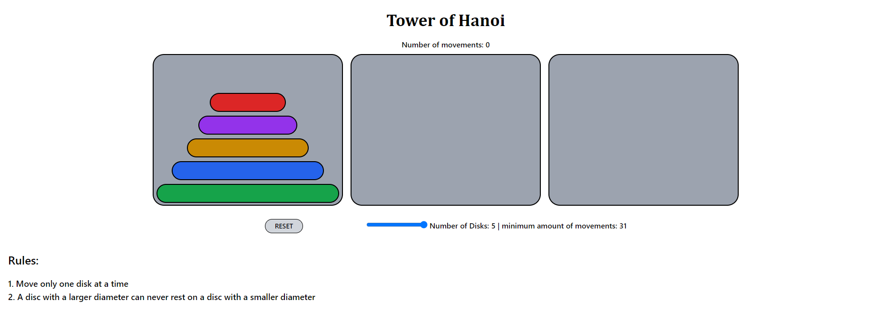

# Torre de Hanoi
 Esse projeto é minha primeira calculadora para praticar conceitos básicos de Javascript, por exemplo, utilizar onclick para adicionar funções com parâmetros(números, funções e propriedades da calculadora), try-catch, método eval() e if/else.
 
 ### Tecnologias utilizadas:

 - Html
 - Tailwindcss
 - Javascript

 ### Veja o site aqui:
https://pabloquirino.github.io/torre-de-hanoi/src/

### Captura de tela:
  

